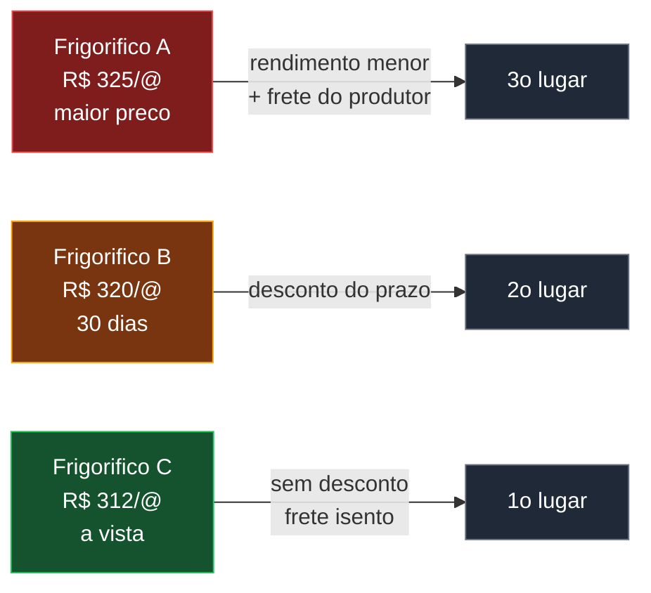
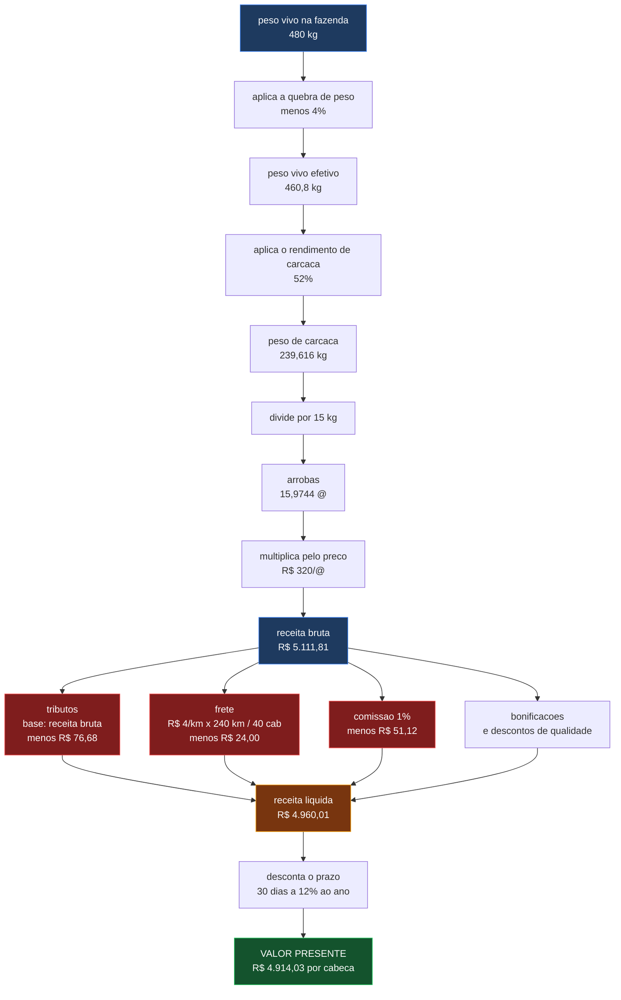
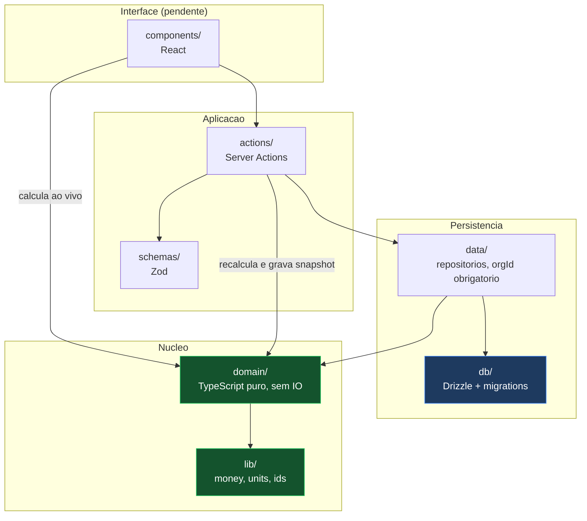
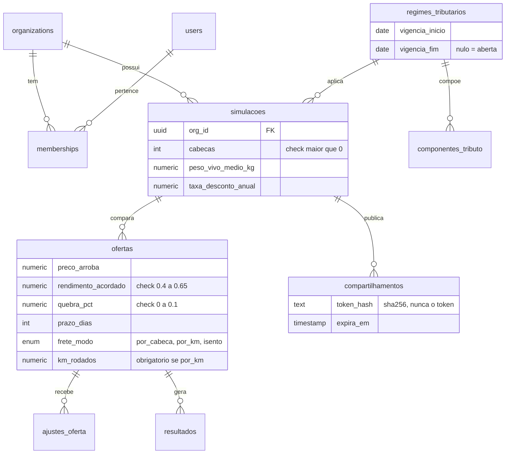

# Simulador de Venda de Gado

> Compara ofertas de compradores de gado e ordena por **valor presente liquido por cabeca**,
> nao por preco bruto da arroba.


---

## O problema

Um frigorifico oferece R$ 320 a arroba com pagamento em 30 dias. Outro oferece R$ 312
a vista. Um terceiro oferece R$ 325, mas com rendimento de carcaca acordado menor e
frete por conta do produtor.

Qual e a melhor? Comparar pelo numero do preco esta errado, e e o que quase todo mundo
faz na mao, no papel.



**A maior arroba costuma nao ser a melhor oferta.** O simulador mostra isso com numero,
nao com opiniao.

---

## Estado do projeto

| Etapa | Entrega | Situacao |
|---|---|---|
| 1 | Dominio de calculo puro, 100% testado | pronto |
| 2 | Esquema de banco, migrations, regimes com vigencia, isolamento multi-tenant | pronto |
| 3 | Autenticacao com Auth.js v5 | pendente |
| 4 | Interface, tabela comparativa, cascata de deducoes, compartilhamento | pendente |

Os testes de banco rodam contra **PGlite**, que e Postgres compilado para WASM em
memoria. Producao usa **Neon**. As migrations sao as mesmas nos dois, entao as
restricoes do esquema sao exercitadas de verdade nos testes, sem rede e sem credencial.

---

## A cadeia de calculo

Tudo por cabeca. Os totais do lote sao multiplicacao no fim, para que o arredondamento
nao se acumule.



### Em formula

```
peso_vivo_efetivo   = peso_vivo_medio_kg * (1 - quebra_pct)
peso_carcaca        = peso_vivo_efetivo * rendimento_acordado
arrobas             = peso_carcaca / 15
receita_bruta       = arrobas * preco_arroba
receita_ajustada    = receita_bruta + bonificacoes - descontos_qualidade
tributos            = receita_bruta * aliquota_do_regime_vigente
frete_por_cabeca    = isento     -> 0
                      por_cabeca -> frete_valor
                      por_km     -> (frete_valor * km_rodados) / cabecas
outras_deducoes     = receita_bruta * comissao_pct + outros ajustes
receita_liquida     = receita_ajustada - tributos - frete_por_cabeca - outras_deducoes
taxa_diaria         = (1 + taxa_desconto_anual) ^ (1/365) - 1
valor_presente      = receita_liquida / (1 + taxa_diaria) ^ prazo_dias
```

---

## Caso de conferencia

Este caso vive em `tests/unit/domain/calculo.test.ts` e pode ser refeito na calculadora.
Lote de 40 cabecas, 480 kg de peso vivo medio, regime de pessoa fisica a 1,5%,
taxa de desconto de 12% ao ano.

| Passo | Conta | Resultado |
|---|---|---:|
| Peso vivo efetivo | `480 x 0,96` | 460,8 kg |
| Peso de carcaca | `460,8 x 0,52` | 239,616 kg |
| Arrobas | `239,616 / 15` | 15,9744 @ |
| Receita bruta | `15,9744 x 320` | R$ 5.111,808 |
| Tributos | `5.111,808 x 0,015` | menos R$ 76,677 |
| Frete | `4,00 x 240 / 40` | menos R$ 24,000 |
| Comissao | `5.111,808 x 0,01` | menos R$ 51,118 |
| **Receita liquida** | | **R$ 4.960,013** |
| **Valor presente** | `4.960,0128 / 1,12^(30/365)` | **R$ 4.914,03** |

---

## Arquitetura

O dominio nao conhece Next, banco nem React. So entra numero e sai numero.
Essa regra nao vive apenas no texto: `tests/unit/domain/isolamento.test.ts` le os
imports de cada arquivo do dominio e falha se algum sair da lista permitida.



**Por que o dominio e isomorfico:** as mesmas funcoes rodam no navegador e no servidor.
O cliente recalcula o ranking inteiro em memoria quando voce mexe na taxa de desconto,
sem ida a rede. O servidor executa as mesmas funcoes ao salvar. Isso elimina a classe
de bug em que a tela mostra um numero e o banco guarda outro.

### Modulos do dominio

| Arquivo | Responsabilidade |
|---|---|
| `peso.ts` | quebra, rendimento, conversao para arrobas |
| `receita.ts` | bruta, bonificacoes, descontos de qualidade |
| `tributos.ts` | composicao da aliquota por regime vigente na data |
| `logistica.ts` | frete isento, por cabeca e por km rodado |
| `valor-presente.ts` | conversao de taxa anual para diaria e VP |
| `calculo.ts` | orquestra a cadeia e carimba `VERSAO_CALCULO` |
| `comparador.ts` | ranking e diferenca entre ofertas |

---

## Modelo de dados



Precisao: `numeric(14,4)` no banco, `decimal.js` no codigo, arredondamento so na exibicao.

---

## Decisoes de projeto

Quatro regras de negocio foram validadas antes de qualquer modelagem. Cada uma esta
registrada em `docs/superpowers/specs/`.

### 1. A base do tributo e a receita bruta

A contribuicao sobre a comercializacao da producao rural, o chamado Funrural, incide
sobre a receita bruta, antes de bonificacoes e de descontos de qualidade.

A aliquota **nunca e constante no codigo**. Ela e dado com data de vigencia, porque
muda por legislacao, e constante escondida vira bug silencioso que so aparece no
fechamento do ano.

| Regime | Previdenciaria | RAT/SAT | SENAR | Total | Vigencia |
|---|---:|---:|---:|---:|---|
| PF sobre receita bruta | 1,20% | 0,10% | 0,20% | **1,50%** | desde 2018 |
| PF sobre receita bruta | 2,00% | 0,10% | 0,20% | **2,30%** | ate 2017 |
| PF optante pela folha | 0 | 0 | 0,20% | **0,20%** | desde 2019 |
| PJ rural sobre receita bruta | 1,70% | 0,10% | 0,25% | **2,05%** | desde 2002 |
| PJ optante pela folha | 0 | 0 | 0,25% | **0,25%** | desde 2019 |

### 2. A quebra de peso e sempre informada

Sem valor padrao, sem sugestao automatica. O campo nasce vazio e e obrigatorio.

A quebra muda o ranking, e um padrao invisivel e uma suposicao que o usuario nao fez.
A interface explica o termo no ponto de uso, com a faixa tipica de 2% a 5% conforme
distancia e tempo de jejum, como texto de apoio e nao como valor preenchido.

### 3. Frete por km e por quilometro rodado, rateado pelo lote

```
frete_total      = frete_valor x km_rodados
frete_por_cabeca = frete_total / cabecas
```

`km_rodados` e a quilometragem que a transportadora cobra. Inclui o retorno vazio se
ela cobrar o retorno.

### 4. Parcelamento fora desta versao

Toda oferta tem prazo unico. A assinatura de `valor-presente.ts` ja modela o fluxo
internamente e trata prazo unico como fluxo de uma parcela de 100%, para que a volta
atras nao vire reescrita.

---

## Seguranca

| Controle | Estado |
|---|---|
| Escopo por organizacao em toda query, com `orgId` tipado | pronto |
| Acesso entre organizacoes falha como nao encontrado, nunca como proibido | pronto, com teste |
| `check` constraints exercitados contra Postgres de verdade | pronto, 13 casos |
| `.env*` fora do controle de versao desde o primeiro commit | pronto |
| `npm audit` limpo, incluindo desenvolvimento | pronto |
| Token opaco de compartilhamento, com `sha256` no banco | esquema pronto, rota pendente |
| Zod em toda Server Action | pendente |
| CSP com nonce no middleware | pendente |

O teste de isolamento foi verificado em ciclo vermelho e verde: removendo o filtro de
organizacao do repositorio, ele acusa o vazamento.

---

## Como rodar

```bash
npm install

# testes, incluindo os de banco contra PGlite em memoria
npm test

# cobertura, com limite de 100% no dominio
npm run test:cov

# tipos, lint e build
npm run typecheck
npm run check
npm run build
```

Para conectar ao Neon, copie `.env.example` para `.env.local` e preencha
`DATABASE_URL`. Depois:

```bash
npm run db:generate   # gera migration a partir do esquema
npm run db:migrate    # aplica no banco configurado
npm run db:studio     # abre o Drizzle Studio
```

---

## Stack

| Camada | Escolha | Por que |
|---|---|---|
| Framework | Next.js 16, App Router | o brief pede 15, ver divergencias |
| Linguagem | TypeScript estrito, `noUncheckedIndexedAccess` | nenhum `any`, indice sempre checado |
| Aritmetica | `decimal.js` | ponto flutuante nao serve para dinheiro |
| Banco | Neon Postgres com Drizzle ORM | serverless por HTTP, sem pool persistente |
| Banco de teste | PGlite | Postgres real em WASM, sem rede |
| Testes | Vitest, cobertura v8 | 156 testes, 100% no dominio |
| Lint | Biome | formatador e linter em um so |

---

## Premissas declaradas

- Uma arroba equivale a 15 kg de carcaca.
- A contribuicao sobre a comercializacao incide sobre a receita bruta.
- A comissao do corretor incide sobre a receita bruta.
- A conversao de taxa anual para diaria e composta, `(1+i)^(1/365)-1`.
  Dividir por 365 subestima o desconto.
- A quebra de peso e sempre informada pelo usuario. O simulador nao adivinha.

## Limitacoes

- **O calculo tributario e estimativa. Ele nao substitui orientacao contabil.**
- Nesta versao cada oferta tem um prazo unico. Pagamento parcelado nao entra.
- ICMS e diferimento estadual estao fora do escopo.
- Um lote por simulacao.

## Divergencias em relacao ao brief de origem

O documento de origem esta em `docs/03-simulador-venda-gado.md`. Duas decisoes desta
implementacao divergem dele, ambas deliberadas e aprovadas:

1. Ele escreve `tributos = receita_ajustada * aliquota_produtor`. Aqui a base e a
   receita bruta, porque e sobre ela que incide a contribuicao.
2. Ele pede Next.js 15. O projeto usa Next 16.3.1, que foi o que o scaffold atual
   entregou. O dominio nao depende de Next, entao a diferenca nao o afeta.

---

## Convencoes

Vocabulario de curral em codigo e interface: cabeca, arroba, quebra, rendimento, prazo,
frete. Identificadores em portugues sem acento. Mensagens de commit em ingles.

Restricao de escrita valida para codigo, README, comentarios e interface:
**nao usar travessao**.
